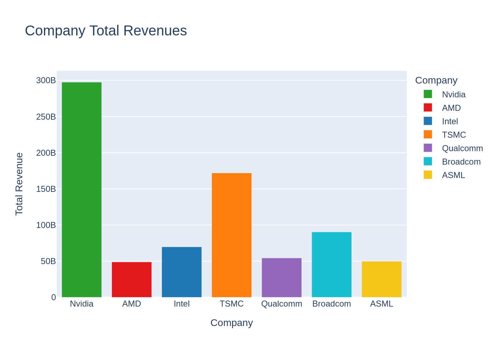
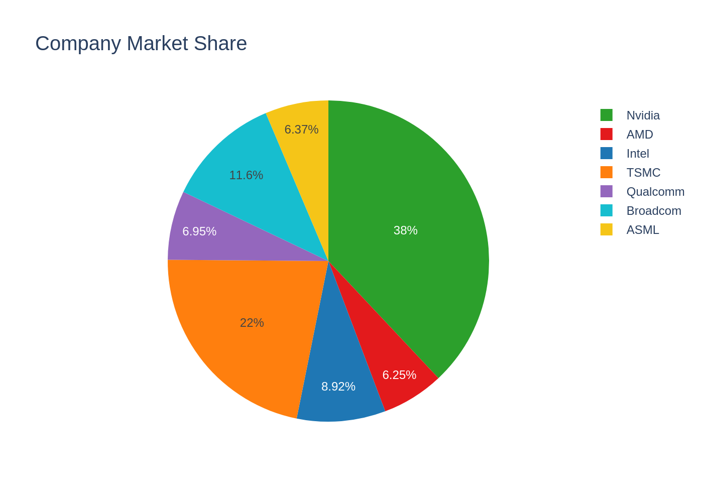
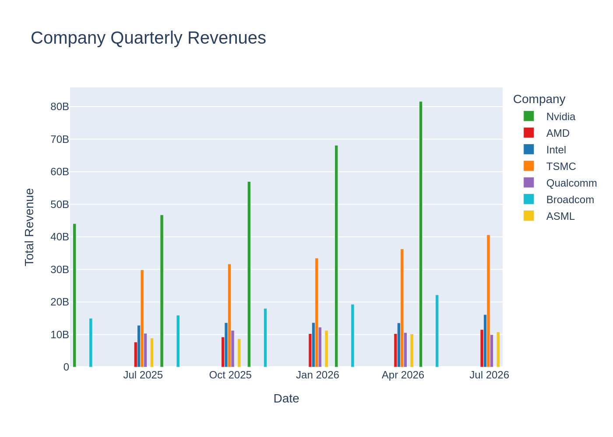
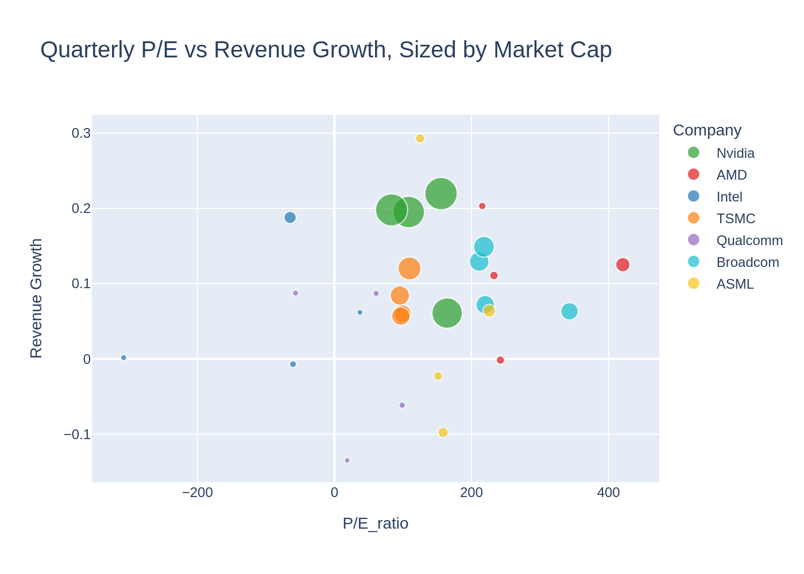
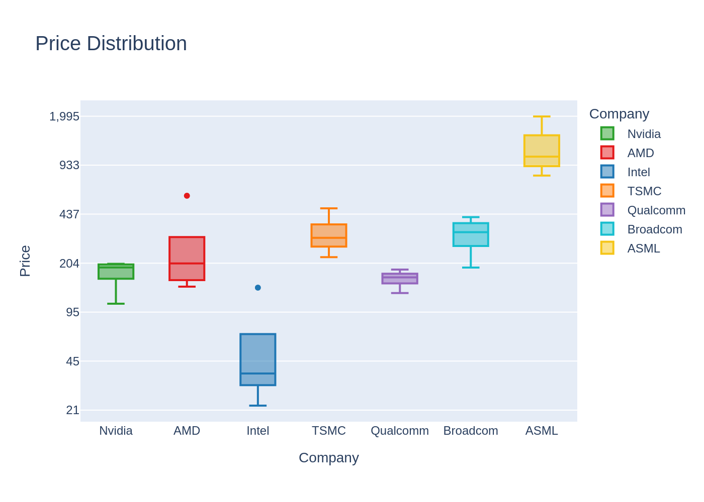
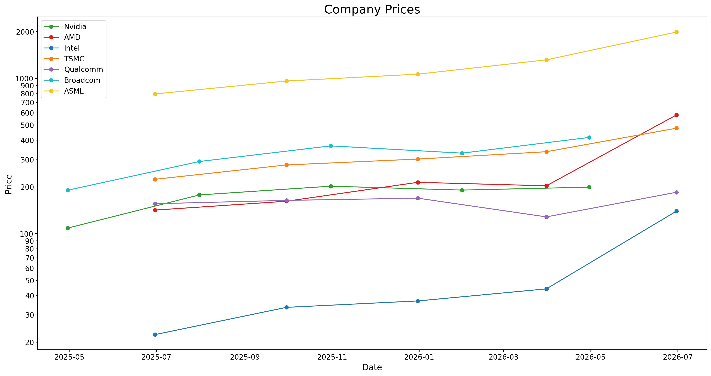

# Semiconductor & Chip Industry Companies; Financial Analysis

Comparing Nvidia against major semiconductor industry peers (AMD, Intel, TSMC, Qualcomm, Broadcom, and ASML) using quarterly financial statements and stock price data to see how Nvidia's financial performance and market valuation stack up against the sector after its record-breaking August 2026 earnings report.

## Motivation

On August 26, 2026, Nvidia published a quarterly report that was followed by a strong positive reaction in the U.S. stock market, with Nvidia itself rising approximately 10% after reporting revenue and earnings above expectations. Since I'd been working with plotly.express and pandas data-cleaning techniques, I used this as an opportunity to build a real comparison: how does Nvidia actually perform financially against its major semiconductor industry peers, and does its stock price reflect that financial position, revenue, share of combined revenue in the sample, market cap, or something else?

**Note:** Data pulled via `yfinance` was current through end of June 2026, so it does **not** include Nvidia's most recent report.

## Repo Structure

```
├── Code/     # Jupyter notebook with data pull, cleaning, and chart generation
├── Data/     # Empty in repo; script downloads fresh data via yfinance on each run
├── Graph/    # Exported chart images (PNG)
└── README.md
```

> Data isn't committed to the repo since the notebook pulls it live from `yfinance` each time it's run; this keeps the analysis reproducible with current data rather than a stale snapshot.

## Tools Used

- `pandas`; data cleaning, merging (`merge_asof`), currency conversion, groupby aggregation
- `yfinance`; quarterly income statements + historical price data
- `plotly.express`; bar, pie, scatter (bubble), and box charts
- `matplotlib`; price trend line chart

## Data & Cleaning

- Companies: Nvidia, AMD, Intel, TSMC, Qualcomm, Broadcom, ASML
- Pulled last 5 quarterly financial statements and 2 years of monthly price history per company
- Cleaned: dropped NaNs, removed unnecessary columns, standardized date types
- Merged quarterly financials with price data using `merge_asof` (backward direction) to align each statement with the most recent available price
- **Currency normalization:** TSMC reports in TWD and ASML in EUR; both converted to USD before cross-company comparison

## Charts

**1. Total Revenue by Company**


**2. Share of Combined Revenue in the Sample**


**3. Quarterly Revenue by Company**


**4. P/E vs Revenue Growth, Sized by Market Cap**


**5. Price Distribution (log scale)**


**6. Price Trend Over Time**


## Analysis

In the first total revenue chart, Nvidia's total revenue is more than 1.5 times that of the highest-revenue company among the remaining companies in the sample. This highlights the scale of Nvidia's revenue generation compared with the other major semiconductor companies included in this analysis.

If we move to the share of combined revenue in the sample pie chart, we can see each company's contribution to the total revenue of all companies included in the sample. Nvidia accounts for approximately 38% of the combined revenue, while TSMC ranks second with approximately 22%.

Let's move on to the third chart, which shows the revenue of the selected companies across quarterly periods based on their reported financial statements. As expected, Nvidia has the highest quarterly revenue among all companies. One notable feature is the consistency of Nvidia's revenue growth across recent quarters. For example, revenue increased by approximately 5% between the first and second quarters, followed by an approximately 20% increase between the following quarters. In comparison, the other companies generally show lower growth rates of around 10%, with some also experiencing quarterly declines.

Based on what we've seen until now, Nvidia appears to be the strongest performer in terms of revenue and revenue growth, so we might expect this strong financial performance to be reflected in its valuation. To find out, let's move on to the next graph, the quarterly P/E vs Revenue Growth sized by Market Cap bubble chart. As mentioned before, the graph shows that the revenue growth of Nvidia is around 20 percent, and unlike other companies, its revenue growth has been more constant, with no sharp changes in recent quarters. Also, Nvidia has the largest bubble, representing the highest market capitalization in the sample. Market capitalization reflects both the company's share price and the number of shares outstanding, rather than its revenue or revenue share directly. With a higher revenue base and market capitalization, it generally becomes more difficult for a company to maintain very high percentage growth rates; Nvidia has the highest market cap and a higher, more constant revenue increase than others. But surprisingly, Nvidia's P/E ratio is not the highest among the companies in the sample. In the latest quarter, Nvidia's P/E ratio was approximately 83.4, which appears relatively moderate compared with some of the other companies in the sample despite Nvidia's stronger revenue growth and much larger market capitalization. This raises an interesting question: does the relatively moderate P/E reflect market expectations, perceived risk, or simply differences in how investors value these companies?

Let's keep this in mind and move to the next chart, price distribution. Something to note about this chart is that the y-axis is on a logarithmic scale, and the box sizes do not represent percentage changes in price. Based on this chart, Nvidia's observed stock price range during the period was approximately $109 to $202. However, this absolute price range alone does not tell us whether Nvidia was more or less volatile than the other companies. To properly compare volatility, we would need to analyze percentage returns or another volatility measure.

Before moving to the final price chart and conclusion, let's sum up what we have so far: Nvidia has the highest total revenue, the largest share of combined revenue in the sample, and strong and relatively consistent revenue growth. Meanwhile, its P/E ratio does not appear exceptionally high relative to the other companies. However, the absolute stock-price comparisons alone do not tell us whether Nvidia has been more or less volatile or has generated better returns. This leaves us with an important question: how closely does Nvidia's financial performance translate into stock-market performance?

In the price trend chart, the absolute stock prices of these companies appear to move within very different ranges, making direct comparison difficult. A higher stock price does not necessarily mean a company is more valuable, since companies have different numbers of shares outstanding and different stock-split histories. More importantly, the chart suggests that strong revenue growth and a large share of combined revenue do not automatically translate into a proportionally higher stock price. Comparing percentage returns would provide a more meaningful measure of stock-market performance.

### Conclusion

To answer these questions, we may need to go beyond the charts and consider market expectations and potential risks. Although we had strong revenue reports and growth, according to a Stocktwits report published on August 13, 2026, NVIDIA's 5-year CDS spread has recently reached 79.8 basis points, more than double its late-May level and close to the 83.7 bp record set in July. This doesn't mean NVIDIA itself is over-leveraged; rather, the concern is that the AI boom is increasingly being financed through debt across the industry. If NVIDIA's customers fail to generate sufficient returns from their AI investments, demand for NVIDIA's GPUs could weaken, putting its future growth at risk.

So my answer is: despite the potential credit-related risks, Nvidia's relatively moderate P/E compared with its strong recent revenue growth may indicate that the stock is not excessively valued relative to its fundamentals. However, P/E alone is not sufficient to conclude that the stock is undervalued. The credit risk is also a potential headwind that could limit future price appreciation. To get a clearer answer, it is worth watching two things going forward: whether the CDS spread keeps climbing or stabilizes in the coming months, and whether Nvidia's next quarterly guidance shows any slowdown in demand related to the returns generated by AI infrastructure investments. These developments could help determine whether the market's caution is temporary or reflects a broader change in Nvidia's growth outlook.

> *This analysis is for educational purposes only, reflects my personal opinion based on public data, and is not financial or investment advice.*

## Challenges & What I Learned

- Handling multi-currency financial statements (TSMC in TWD, ASML in EUR) and converting them to a common USD basis before comparison
- Aligning two different data frequencies (monthly price data vs. quarterly statements) using `merge_asof`
- Keeping consistent colors and category ordering across five different Plotly chart types plus a separate matplotlib chart
- Debugging a P/E ratio formula error (had it inverted initially) and a `groupby().value_counts()` step that wasn't doing what it looked like it was doing
- Formatting log-scale axes to show plain numbers instead of scientific notation / powers of ten

## What I'd Improve Next

- Re-run once the latest Nvidia earnings report is reflected in `yfinance` data
- Use historical exchange rates per quarter instead of a single static conversion rate for TWD/EUR
- Add error handling for tickers with missing or delayed financial data
- Extend the analysis with a rolling correlation between revenue growth and price movement
- Compare stock performance using percentage returns and volatility measures rather than absolute stock prices
